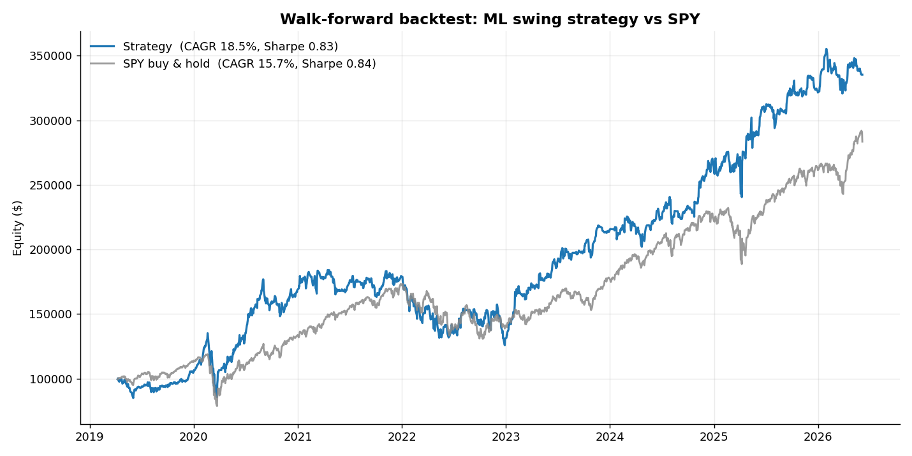
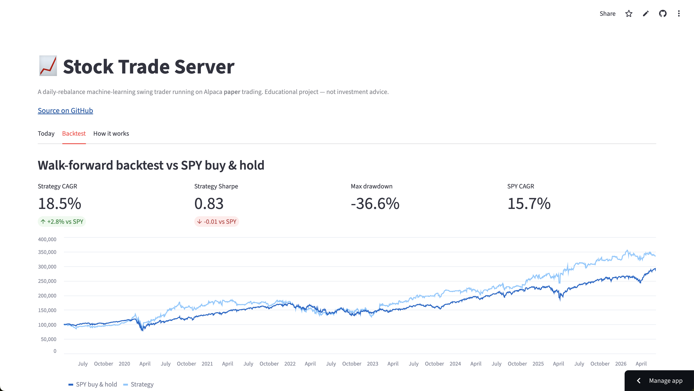

# Stock Trade Server

[](https://github.com/ryanchan339/stock-trade-server/actions/workflows/daily.yml)
[](https://stock-trade-server.streamlit.app)
[](https://www.python.org)

A daily-rebalance, machine-learning swing-trading bot for **Alpaca paper trading**.
It trains a gradient-boosted classifier on free Yahoo Finance history, scores a
universe of liquid large-caps once a day, and holds a small long-only portfolio
of the highest-confidence names — rebalancing daily with hard risk limits.

> **This is a research / educational project on a paper account. It is not
> investment advice and is not wired to real money.** See *Honest results* below:
> as configured it does **not** beat SPY buy-and-hold. Treat it as a framework to
> iterate on, not a money printer.

---

## How it works

```
Yahoo Finance (daily OHLCV)
        │
        ▼
  feature engineering ──►  technical indicators (RSI, MACD, momentum,
        │                  moving-average ratios, volatility, Bollinger…)
        ▼
  HistGradientBoosting  ──►  P(forward 5-day return > 0) per stock-day
        │
        ▼
  portfolio rules       ──►  long top-N names above a probability threshold,
        │                    confidence-weighted, per-name cap, stop-loss
        ▼
  Alpaca paper account  ──►  daily market-order rebalance toward target weights
```

### Why these choices
- **Daily horizon, not true HFT.** Yahoo data is daily and Alpaca is a
  REST API over the internet — microsecond HFT is impossible here. Daily swing
  trading has a cleaner signal-to-noise ratio and near-zero sensitivity to
  latency. (We discussed this trade-off before building.)
- **Gradient-boosted trees (`HistGradientBoostingClassifier`).** Fast, robust on
  tabular/technical features, hard to overfit with regularization, and ships with
  scikit-learn (no native build headaches). It predicts a *probability*, which we
  use directly for position sizing.
- **Walk-forward backtest.** The model is retrained on a rolling window and only
  ever trains on labels whose forward window has already resolved, so reported
  performance has no lookahead bias.

---

## Dashboard

A free [Streamlit](https://stock-trade-server.streamlit.app) dashboard showcases
the live paper account and the backtest. It reads only the result files committed
by the daily GitHub Action, so it needs no secrets and redeploys automatically on
every push.

**Backtest equity curve (walk-forward, vs SPY buy & hold):**



**Live dashboard:**

> _Add a screenshot here once deployed:_ run `streamlit run dashboard.py`, grab a
> screenshot of the running app, save it to `docs/dashboard.png`, and it will
> render below.

<!--  -->

The dashboard has three tabs:
- **Today** — paper equity, current target portfolio, model scores, and the
  account's equity over time.
- **Backtest** — strategy vs SPY equity curves and the headline metrics.
- **How it works** — the architecture and design rationale.

Run it locally with:

```bash
streamlit run dashboard.py
```

---

## Project layout

```
config.yaml            # universe, model, strategy, backtest, risk settings
.env.example           # Alpaca paper API keys (copy to .env)
src/
  config.py            # config + credential loading
  data.py              # yfinance download + local pickle cache
  features.py          # technical indicators + label construction
  model.py             # train / save / load the classifier
  strategy.py          # probabilities -> target portfolio weights
  backtest.py          # walk-forward simulation + metrics
  broker.py            # Alpaca trading wrapper (notional orders, stop-loss)
  trade.py             # the daily inference + execution routine
scripts/
  train.py             # python -m scripts.train
  backtest.py          # python -m scripts.backtest [--plot]
  run_daily.py         # python -m scripts.run_daily [--dry-run]
```

---

## Setup

```bash
python3 -m venv venv
source venv/bin/activate
pip install -r requirements.txt

# Alpaca paper keys (https://app.alpaca.markets -> Paper Trading -> API Keys)
cp .env.example .env
# edit .env and paste your ALPACA_API_KEY / ALPACA_SECRET_KEY
```

## Usage

```bash
# 1. Train on Yahoo history (writes artifacts/model.joblib)
python -m scripts.train

# 2. Backtest with an SPY benchmark (add --plot for a PNG equity curve)
python -m scripts.backtest

# 3. See today's target portfolio WITHOUT trading
python -m scripts.run_daily --dry-run

# 4. Run the live paper-trading rebalance (needs .env keys)
python -m scripts.run_daily
```

### Running on a server

Schedule `run_daily` once per trading day, shortly after the open. Example cron
(09:35 US/Eastern, Mon–Fri):

```cron
35 9 * * 1-5  cd /path/to/Stock\ Trade\ Server && \
  venv/bin/python -m scripts.run_daily >> logs/daily.log 2>&1
```

Retrain weekly or monthly:

```cron
0 18 * * 0  cd /path/to/Stock\ Trade\ Server && venv/bin/python -m scripts.train
```

The job is safe to run when the market is closed — it logs a warning and skips
execution rather than queuing orders.

---

## Configuration

Everything tunable lives in `config.yaml`:

| Section     | Key                    | Meaning |
|-------------|------------------------|---------|
| `model`     | `horizon`              | Forward-return window the label is built on (days). |
| `model`     | `params`               | Gradient-boosting hyperparameters. |
| `strategy`  | `prob_threshold`       | Minimum up-probability to take a position. |
| `strategy`  | `max_positions`        | Max simultaneous long names. |
| `strategy`  | `max_weight_per_name`  | Per-name weight cap (diversification). |
| `strategy`  | `stop_loss`            | Exit a name down more than this from entry. |
| `backtest`  | `train_years`          | Rolling training window length. |
| `backtest`  | `retrain_every`        | Retrain cadence in trading days. |
| `backtest`  | `cost_bps`             | Assumed round-trip transaction cost. |

---

## Honest results

A walk-forward backtest over ~7 years of the default 15-stock universe (run it
yourself with `python -m scripts.backtest`):

| Metric            | Absolute labels | **Market-relative labels** | SPY buy & hold |
|-------------------|-----------------|----------------------------|----------------|
| CAGR              | ~9%             | **~18.5%**                 | ~16%           |
| Sharpe            | ~0.48           | **~0.83**                  | ~0.84          |
| Max drawdown      | ~-41%           | **~-37%**                  | ~-34%          |

The big lever was the **training label**. Predicting "does the stock *rise*"
(absolute) underperforms the index, because it rewards the model for riding
market beta you already get free from SPY. Switching the label to "does the stock
*beat the benchmark* over the next `horizon` days" (`model.relative_label: true`,
the default) roughly **doubled both CAGR and Sharpe** and pushed total return past
buy-and-hold.

Honest caveat: it now **beats SPY on raw return but only ties it on Sharpe** — the
book is still long-only, so it carries full market beta and a similar drawdown.
The next lever (long/short) is what would lift risk-adjusted return above the
index by hedging that beta.

### Ideas to improve it further
- **Long/short:** short the lowest-probability names to hedge market beta and
  raise Sharpe above the index.
- **Volatility targeting / regime filter:** cut exposure in high-volatility or
  downtrending regimes to tame the -37% drawdown.
- **Bigger / sector-diversified universe** and proper hyperparameter search with
  purged, embargoed cross-validation.
- **Probability calibration** (`CalibratedClassifierCV`) so weights reflect true
  edge.

---

## Disclaimer

Educational software for **paper trading only**. Markets involve risk of loss.
Nothing here is financial advice. Do not point this at a live brokerage account
without understanding and accepting the consequences.
